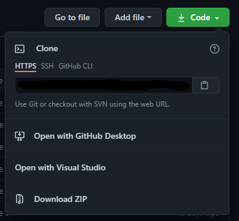
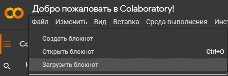

# Инструкция по установке

Затем заходите в [colab](https://colab.research.google.com/) (нужент аккаунт Google) и нажимаете на "Файл -> Загрузить блокнот", загружаете файл блокнота .ipynb (все файлы у меня подписаны как main.ipynb)  
  
В самих файлах ставите значения указанные у вас в задании
